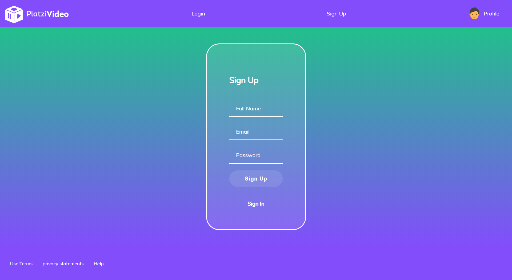

# FrontendCourse
In this repository, there are all class of Frontend Course.

## What I learned?
First steps HTML and CSS. Learning HTML and CSS basic structure, HTML tags, classes and CSS Flexbox and its properties.

## Proyects
A website "PlatziVideo" course proyect, and doing a few challenges of the course, applying everything learned.

## PlatziVideo
It's a basic website where we can look at a few photos. Icluding login/register.

Star this repository :)